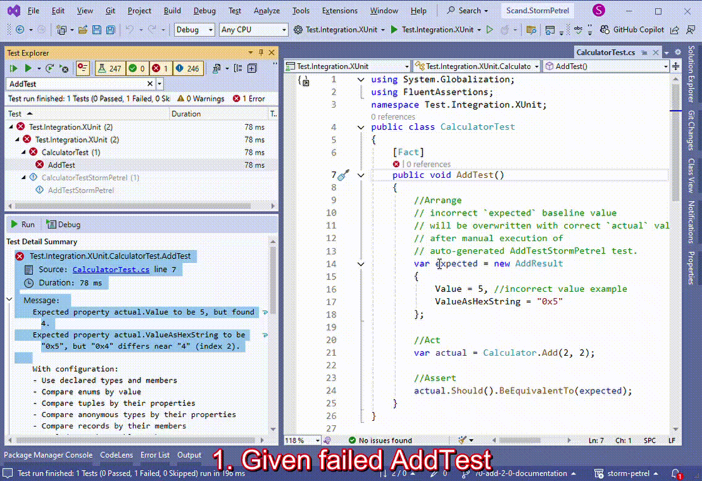

[](https://scand.com/products/storm-petrel-expected-baselines-rewriter)
# Scand Storm Petrel Generator
* [Overview](#overview)
* [Primary Use Cases](#primary-use-cases)
    * [Enabler: Auto-Generate `CalculatorTestStormPetrel.AddTestStormPetrel`](#enabler-auto-generate-calculatorteststormpetreladdteststormpetrel)
    * [Overwrite `CalculatorTest.AddTest` expected baseline](#overwrite-calculatortestaddtest-expected-baseline)
    * [Overwrite `CalculatorTestTheory.AddTestGetExpected` expected baseline method](#overwrite-calculatortesttheoryaddtestgetexpected-expected-baseline-method)
    * [Use Case Variations](#use-case-variations)
        * [Expected variable expression is static property assignment](#expected-variable-expression-is-static-property-assignment)
        * [Expected expression is test method argument what comes from](#expected-expression-is-test-method-argument-what-comes-from)
            * [Test case attribute](#test-case-attribute)
            * [Test data source attribute](#test-data-source-attribute)
        * [Snapshots of Snapshot Testing](#snapshots-of-snapshot-testing)
        * [Expected expression decorators](#expected-expression-decorators)
        * [Expected expression is inlined within an assertion](#expected-expression-is-inlined-within-an-assertion)
            * [FluentAssertions expressions](#fluentassertions-expressions)
            * [xUnit assertions](#xunit-assertions)
            * [NUnit assertions](#nunit-assertions)
            * [MSTest assertions](#mstest-assertions)
            * [Custom assertions that replicate the signatures above](#custom-assertions-that-replicate-the-signatures-above)
* [Getting Started](#getting-started)
* [Configuration](#configuration)
* [Supported Software](#supported-software)
    * [Test Frameworks](#test-frameworks)
    * [.NET Versions](#net-versions)
    * [Operating Systems and IDEs](#operating-systems-and-ides)
* [CHANGELOG](#changelog)
* [FAQs](#faqs)
* [References](#references)

## Overview
[](https://www.nuget.org/packages/Scand.StormPetrel.Generator)

.NET Incremental Generator that creates modified copies of unit and/or integration tests to update expected baselines in original tests, automating baseline creation and accelerating test development.

[](assets/primary-use-case.gif)

## Primary Use Cases

### Enabler: Auto-Generate `CalculatorTestStormPetrel.AddTestStormPetrel`

###### Given
`Calculator` class with a bug introduced by the `buggyDelta` variable:
```csharp
public class Calculator
{
    public static AddResult Add(int a, int b)
    {
        var buggyDelta = 1;
        var result = a + b + buggyDelta;
        return new AddResult
        {
            Value = result,
            ValueAsHexString = "0x" + result.ToString("x"),
        };
    }
}

public class AddResult
{
    public int Value { get; set; }
    public string ValueAsHexString { get; set; } = string.Empty;
}
```

And its corresponding test with an expected baseline that matches the `Calculator.Add` buggy behavior:

```csharp
public class CalculatorTest
{
    [Xunit.Fact]
    public void AddTest()
    {
        //Arrange
        // incorrect `expected` baseline value will be overwritten with correct `actual` value
        // after manual execution of auto-generated AddTestStormPetrel test.
        var expected = new AddResult
        {
            Value = 5, //incorrect value example
            ValueAsHexString = "0x5"
        };

        //Act
        var actual = Calculator.Add(2, 2);

        //Assert
        actual.Should().BeEquivalentTo(expected);
    }
}
```

##### When
The developer configures the test project with StormPetrel.Generator as per the [Getting Started](#getting-started).

##### Then
A new test method, `CalculatorTestStormPetrel.AddTestStormPetrel`, is generated. This method is a specially modified copy of the original CalculatorTest.AddTest to overwrite its expected baseline.

### Overwrite `CalculatorTest.AddTest` expected baseline
##### Given
`CalculatorTestStormPetrel.AddTestStormPetrel` is auto-generated after enabling Storm Petrel functionality.
##### When
The developer fixes `buggyDelta` to `0`
and executes `CalculatorTestStormPetrel.AddTestStormPetrel` test.
##### Then
`CalculatorTest.AddTest` code is populated with correct expected baseline value, i.e. its code becomes
```csharp
public class CalculatorTest
{
    [Xunit.Fact]
    public void AddTest()
    {
        //Arrange
        // incorrect `expected` baseline value will be overwritten with correct `actual` value
        // after manual execution of auto-generated AddTestStormPetrel test.
        var expected = new AddResult
        {
            Value = 4,
            ValueAsHexString = "0x4"
        };

        //Act
        var actual = Calculator.Add(2, 2);

        //Assert
        actual.Should().BeEquivalentTo(expected);
    }
}
```
##### So that
The developer should only review expected baseline changes (no manual modification) what typically saves development time.

### Overwrite `CalculatorTestTheory.AddTestGetExpected` expected baseline method
##### Given
`CalculatorTestTheory.AddTest` test below with

* multiple use cases;
* AddTestGetExpected static method call returning incorrect expected baselines based on arguments;
* AddTestGetExpected method possible variations per its comments.
```csharp
public class CalculatorTestTheory
{
    [Xunit.Theory]
    [Xunit.InlineData(1, 5)]
    [Xunit.InlineData(2, 2)]
    [Xunit.InlineData(2, 3)]
    public void AddTest(int a, int b)
    {
        //Arrange
        var expected = AddTestGetExpected(a, b);

        //Act
        var actual = Calculator.Add(a, b);

        //Assert
        actual.Should().BeEquivalentTo(expected);
    }

    /// <summary>
    /// Possible variations of AddTestGetExpected static method are:
    /// - Method body may have pattern matches within pattern matches.
    /// - Method body may have `switch` and/or `if` expressions with return statements returning expected baselines.
    /// - The method may be placed in another class and/or file.
    /// </summary>
    private static AddResult AddTestGetExpected(int a, int b) => (a, b) switch
    {
        (1, 5) => new AddResult(), // should be overwritten with correct expected baseline after
                                   // CalculatorTestTheoryStormPetrel.AddTestStormPetrel execution
        (2, 2) => new AddResult(),
        (2, 3) => new AddResult(),
        _ => throw new InvalidOperationException(),
    };
}
```
##### When
The developer executes `CalculatorTestTheoryStormPetrel.AddTestStormPetrel` test.
##### Then
`CalculatorTestTheory.AddTestGetExpected` code is populated with correct expected baseline values, i.e. its code becomes
```csharp
private static AddResult AddTestGetExpected(int a, int b) => (a, b) switch
{
    (1, 5) => new AddResult
    {
        Value = 6,
        ValueAsHexString = "0x6"
    }, //should be overwritten with correct expected baseline
    (2, 2) => new AddResult
    {
        Value = 4,
        ValueAsHexString = "0x4"
    },
    (2, 3) => new AddResult
    {
        Value = 5,
        ValueAsHexString = "0x5"
    },
    _ => throw new InvalidOperationException(),
};
```
##### So that
The developer should only review expected baseline changes (no manual modification) what typically saves development time.

### Use Case Variations

#### Expected variable expression is static property assignment
See [PropertyTest](Test.Integration.XUnit/PropertyTest.cs) for more details.

#### Expected expression is test method argument what comes from

##### Test case attribute
Supported attributes are xUnit InlineData, NUnit TestCase, MSTest DataRow. See [AttributesTest](Test.Integration.XUnit/AttributesTest.cs) for more details.

##### Test data source attribute
Supported attributes are xUnit MemberData or ClassData, NUnit TestCaseSource, MSTest DynamicData. See [TestCaseSourceMemberDataTest](Test.Integration.XUnit/TestCaseSourceMemberDataTest.cs), [TestCaseSourceClassDataTest](Test.Integration.XUnit/TestCaseSourceClass/TestCaseSourceClassDataTest.cs), [NUnit TestCaseSourceTest](Test.Integration.NUnit/TestCaseSourceTest.cs), [MSTest TestCaseSourceTest](Test.Integration.MSTest/TestCaseSourceTest.cs) for more details.
Known limitations:
* The attributes should be configured against data source methods or properties, not fields.

#### Snapshots of Snapshot Testing
HTML, JSON, binary or whatever expected snapshots can be hardcoded in tests code. See couple examples in [SnapshotTest](Test.Integration.XUnit/SnapshotTest.cs).

#### Expected expression decorators
Refer to the classes in the `Scand.StormPetrel.Generator.Utils` namespace and their usage in the files of the [Test.Integration.Generator.Utils.XUnit](Test.Integration.Generator.Utils.XUnit/Test.Integration.Generator.Utils.XUnit.csproj) project to decorate expressions with
* Collection initializer;
* Implicit object creation.

#### Expected expression is inlined within an assertion

With StormPetrel, the expected variable can be entirely omitted. Instead, you can inline expected expressions of the following kinds:
- Anonymous object creation expressions;
- Array creation expressions;
- Collection expressions;
- Implicit array creation expressions;
- Implicit object creation expressions;
- Literal expressions (e.g., numeric or string literals);
- Object creation expressions;
- Tuple expressions.

Refer to the sections below for more details about supported assertions and examples of expected expressions.

##### FluentAssertions expressions
Supported expressions include `actual.Should().Be(123);`, `actual.SomePropertyOrMethodCall.Should().Be("string value");`, and `actual.Should().BeEquivalentTo(new MyClass{...});`. See more examples in [NoExpectedVarTest](Test.Integration.XUnit/NoExpectedVarTest.cs) and [NoExpectedVarExpressionKindsTest](Test.Integration.XUnit/NoExpectedVarExpressionKindsTest.cs).

##### xUnit assertions
Supported expressions include `Assert.Equal(123, actual);`, `Assert.StrictEqual("string value", actual);`, and `Assert.Equivalent("string value", actual);`. See more examples in [NoExpectedVarAssertTest](Test.Integration.XUnit/NoExpectedVarAssertTest.cs).

##### NUnit assertions
Supported expressions include `Assert.That(actual, Is.EqualTo(123));` and `Assert.That(actual, Is.EquivalentTo(new MyClass{...}));`. See more examples in [NoExpectedVarAssertThatTest](Test.Integration.NUnit/NoExpectedVarAssertThatTest.cs).

##### MSTest assertions
Supported expressions include `Assert.AreEqual(123, actual);`. See more examples in [NoExpectedVarAssertTest](Test.Integration.MSTest/NoExpectedVarAssertTest.cs).

##### Custom assertions that replicate the signatures above
You can also implement and use custom assertions. Ensure they replicate the signatures of the assertions mentioned above so that StormPetrel can detect them effectively.

## Getting Started
To utilize the StormPetrel tests, add the following NuGet Package references to your test project:
* Scand.StormPetrel.Generator.
* Object to C# code dumper. Typically, it represents `actual` test instance as C# code. See `DumperExpression` in [Configuration](#configuration) for more details.
    * **Option A**. [VarDump](https://www.nuget.org/packages/VarDump). Must be referenced in the case of StormPetrel.Generator default configuration (no `appsettings.StormPetrel.json` file in the test project). May be additionally configured.
    * **Option B**. [ObjectDumper.NET](https://github.com/thomasgalliker/ObjectDumper). May be referenced and configured.
    * **Option C**. Custom implementation of `IGeneratorDumper` interface. May be developed and configured.
    * **Option D**. [Scand.StormPetrel.FileSnapshotInfrastructure](https://www.nuget.org/packages/Scand.StormPetrel.FileSnapshotInfrastructure). Typically, it represents the `actual` test instance as a checksum and writes the instance bytes to a snapshot file in the `IGeneratorRewriter` implementation. It may be referenced and configured according to its [settings](../file-snapshot-infrastructure/README.md#getting-started).

## Configuration
The StormPetrel Generator introduces several interfaces and classes to the Scand.StormPetrel.Generator.TargetProject namespace of the test project. These can be utilized alongside an optional JSON file to customize the rewriting of expected baselines. Key interfaces and classes include:
* `IGenerator`, `Generator`;
* `IGeneratorBackuper`, `GeneratorBackuper`;
* `IGeneratorDumper`, `GeneratorDumper`;
* `IGeneratorRewriter`, `GeneratorRewriter`.

Optionally `appsettings.StormPetrel.json` file (its `Build Action` should be `C# analyzer additional file`) can be added to a test project to configure Storm Petrel functionality.
The file changes are applied `on the fly` and can have the following settings:
```jsonc
{
  "$schema": "https://raw.githubusercontent.com/Scandltd/storm-petrel/main/generator/assets/appsettings.StormPetrel.Schema.json", // [optional] string, path to json schema.
  "TargetProjectGeneratorExpression": "...", // [optional] string, configures the default `Generator`. An expression for the `IGenerator` instance.
  "GeneratorConfig":             // [optional] object to configure `Generator` behavior.
  {
    "BackuperExpression": "...", // [optional] string, instantiates `GeneratorBackuper` by default. An expression for the `IGeneratorBackuper` instance. Set to 'null' to skip creating backup files.
    "DumperExpression": "...",   // [optional] string, instantiates `GeneratorDumper` by default. An expression for the `IGeneratorDumper` instance. `GeneratorDumper` references [VarDump](https://www.nuget.org/packages/VarDump) stuff. Use
                                 // - "new Scand.StormPetrel.Generator.TargetProject.GeneratorDumper(CustomCSharpDumperProvider.GetCSharpDumper())" to have `VarDump` with custom options. Need to implement `CustomCSharpDumperProvider.GetCSharpDumper()` method in this case.
                                 // - "new Scand.StormPetrel.Generator.TargetProject.GeneratorObjectDumper()" expression for `GeneratorObjectDumper` instance which references [ObjectDumper.NET](https://github.com/thomasgalliker/ObjectDumper) stuff.
                                 // - "new Scand.StormPetrel.Generator.TargetProject.GeneratorObjectDumper(CustomOptionsProvider.GetDumpOptions())" to have `ObjectDumper.NET` with custom options. Need to implement `CustomOptionsProvider.GetDumpOptions()` method in this case.
                                 // - "new CustomClassImplementingIGeneratorDumper()" or similar expression to have totally custom implementation of dumping of an instance to C# code.
    "RewriterExpression": "..."  // [optional] string, instantiates `GeneratorRewriter` by default. An expression for the `IGeneratorRewriter` instance.
  },
  "IsDisabled": false,           // [optional] boolean, false is by default. Indicates whether the generator should create 'StormPetrel' classes.
                                 // Even if set to 'false', the generator still adds classes like 'IGeneratorDumper', 'GeneratorDumper' to avoid test project compilation failures
                                 // in the case when custom classes uses them.
  "IgnoreFilePathRegex": "...",  // [optional] string, empty by default. Regular Expression to exclude certain paths from 'StormPetrel' class generation.
  "IgnoreInvocationExpressionRegex": "...",  // [optional] string, empty by default. Regular Expression to detect invocation expressions to not execute StormPetrel rewriting for.
                                 // The property can be utilized in the case of custom IGeneratorRewriter implementations (e.g. when expected baseline is not stored in C# code but binary file as in File Snapshot Testing approach).
  "Serilog": "...",              // [optional] Logging configuration using Serilog (https://github.com/serilog/serilog-settings-configuration?tab=readme-ov-file#serilogsettingsconfiguration--).
                                 // Defaults to logging warnings to the test project's Logs folder. Set to 'null' to disable logging.
                                 // Use the '{StormPetrelRootPath}' token to indicate the target test project root path.
  "TestVariablePairConfigs": [   // [optional] array of objects. Configures naming pairs for actual/expected variables to generate correct expected baselines.
    {
      "ActualVarNameTokenRegex": "[Aa]{1}ctual",     // Default configuration object. Assumes variable pair names like (expected, actual), (myExpected, myActual), (expectedOne, actualOne), (ExpectedTwo, ActualTwo), etc.
      "ExpectedVarNameTokenRegex": "[Ee]{1}xpected", // Corresponds to the `ActualVarNameTokenRegex` for pairing.
    },
    {
      "ActualVarNameTokenRegex": "[Aa]{1}ctual",     // One more default configuration object.
      "ExpectedVarNameTokenRegex": null,             // A `null` value indicates that the expected variable may be missing.
                                                     // In such cases, StormPetrel should analyze the assertion expressions to rewrite their `expected` segments with actual values.
    }
  ]
}
```

## Supported Software

### Test Frameworks
* [xUnit](https://xunit.net/)
* [NUnit](https://nunit.org/)
* [MSTest](https://github.com/microsoft/testfx/)

### .NET Versions
* .NET Standard 2.0+
* .NET 8.0+
* .NET Framework 4.6.2+

### Operating Systems and IDEs
* Windows, Linux. See more details about macOS and IDEs [here](#what-operating-systems-and-ides-can-i-use-to-run-stormpetrel-tests).

## CHANGELOG

See [CHANGELOG](CHANGELOG.md) for more details.

## FAQs

### Does Scand.StormPetrel help developers track incorrect expected baselines in tests?
Developers can already track incorrect expected baselines without *Scand.StormPetrel*. They *should* manually review the changes made by *Scand.StormPetrel* to the expected baselines and decide if they are correct. This is the same approach used when *Scand.StormPetrel* is not involved.

### Does Scand.StormPetrel violate Test Driven Development (TDD) practices?
We believe it does not. Here are the corresponding TDD [steps](https://martinfowler.com/bliki/TestDrivenDevelopment.html) with comments explaining why it does not violate the practices:

* **Write a test for the next bit of functionality you want to add.**\
*Scand.StormPetrel* does *not* assist in creating test case input parameters.
It cannot help create the expected baseline at this step because there is no actual result yet. Therefore, the expected baseline is either:
    * A default instance
    * A manually created instance
* **Write the functional code until the test passes.**\
*Scand.StormPetrel* *can* automatically update the default or manually created instance with the actual value here. The developer *should* then review the changes to decide if the test truly passes.

### What is the suggested configuration of Scand.StormPetrel for typical CI/CD and development environments?
The suggested configuration in the `appsettings.StormPetrel.json` file is:
```jsonc
{
    "$schema": "https://raw.githubusercontent.com/Scandltd/storm-petrel/main/generator/assets/appsettings.StormPetrel.Schema.json", //Specify the path to observe schema suggestions in IDEs.
    "GeneratorConfig": {
        "BackuperExpression": null, //No need to backup because developers typically keep backups under Git or other Version Control Systems.
        "DumperExpression": ...,    //According to your requirements.
        "RewriterExpression": ...   //According to your requirements.
    },
    "IsDisabled": false,            //Keep `true` under Git control for CI/CD to speed up test compilation and execution time.
                                    //Keep `false` on the developer's machine, which should not be tracked by Git. StormPetrel tests are always available.
                                    //Keep `true` on the developer's machine. Can be changed ad hoc to `false` to compile StormPetrel tests.
    "Serilog": null                 //Avoid logging.
}
```

### Can test project compilation fail after enabling Scand.StormPetrel? How can I avoid the failure?
*Scand.StormPetrel* relies on code syntax, not semantics. Therefore, it cannot properly generate *StormPetrel* test methods in all cases, and test project compilation might fail. You can detect the original test file causing the failure and add it to the `"IgnoreFilePathRegex"` property in the [configuration](#configuration) to avoid the compilation error while still using *Scand.StormPetrel* for other tests.

### Scand.StormPetrel constantly changes my expected baseline because the actual result has new property values (e.g., CreatedOn with the current time, auto-incremented Id, random Guid, etc.) every StormPetrel test call. How can I avoid these constant changes?
It is likely that you also ignore the property in the test assertion; otherwise, the test would fail.
An option is to always have a default value for the property while dumping it to C# code using *Scand.StormPetrel*.
This can be implemented via custom configuration or the implementation of [IGeneratorDumper](../abstraction/Scand.StormPetrel.Generator.Abstraction/IGeneratorDumper).
See an example of how this is implemented via the `GetDumpOptions` method in [Test.Integration.XUnit/Utils](Test.Integration.XUnit/Utils.cs) and configured in [Test.Integration.XUnit/appsettings.StormPetrel.json](Test.Integration.XUnit/appsettings.StormPetrel.json).

### What Operating Systems and IDEs can I use to run StormPetrel tests?
You can definitely use Windows or Linux with:
* Command line tools like `dotnet test ... --filter "FullyQualifiedName~StormPetrel"`.
* [Visual Studio](https://visualstudio.microsoft.com/) Test Explorer.

You can also likely use:
* macOS.
* Test runners in other IDEs like [Visual Studio Code](https://code.visualstudio.com/) or [JetBrains Rider](https://www.jetbrains.com/rider/) on Windows, Linux, or macOS, if applicable.

## References

At SCAND, we specialize in [building advanced .NET solutions](https://scand.com/technologies/net/) to help businesses develop new or modernize their legacy applications. If you need help getting started with Storm Petrel or support with implementation, we're ready to assist. Whether you're refactoring or rewriting, our team can help solve any challenges you might face. Visit our [page](https://scand.com/contact-us/) to learn more, or reach out for hands-on guidance.